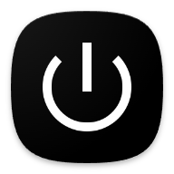
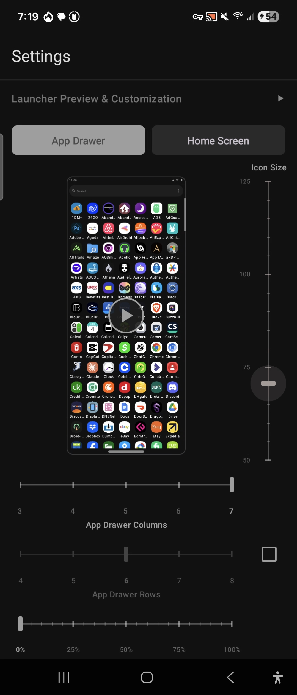
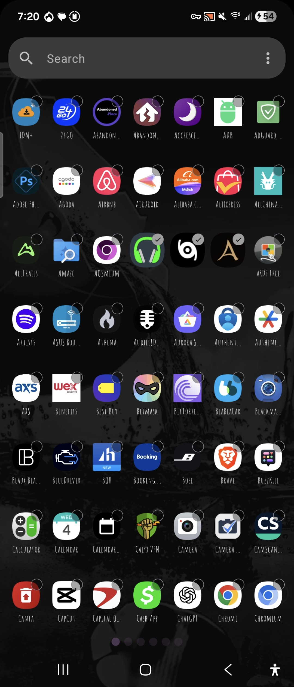
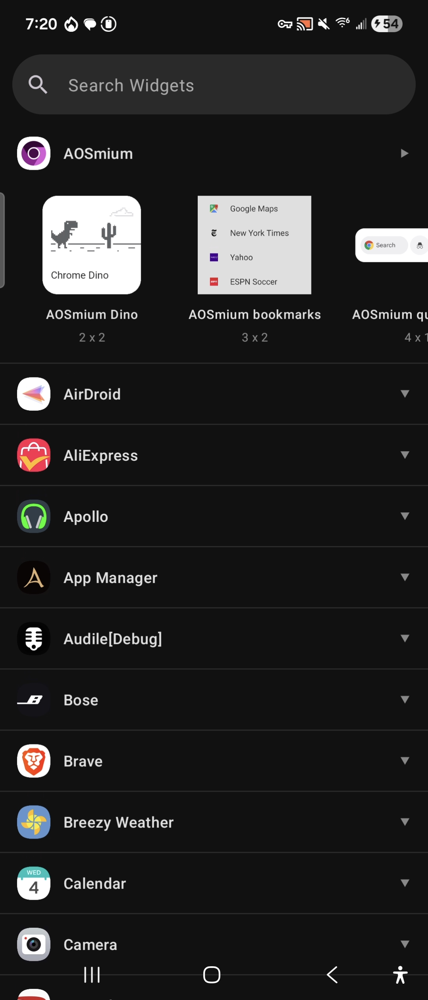
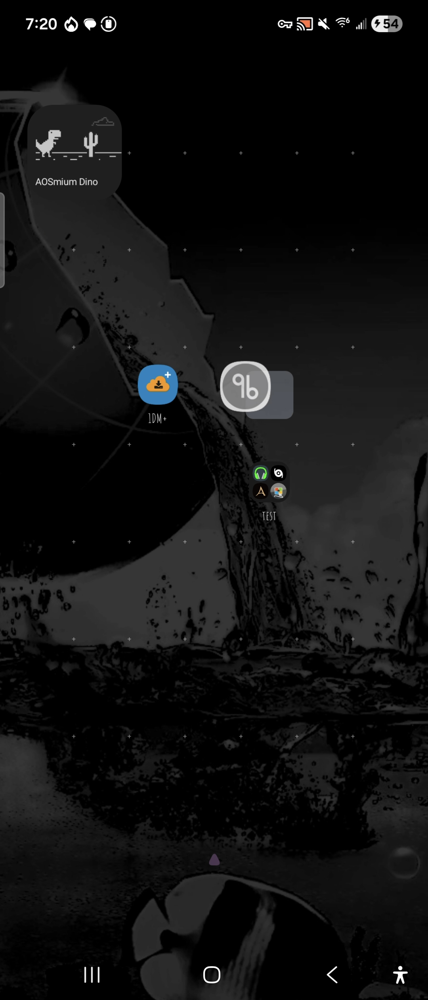
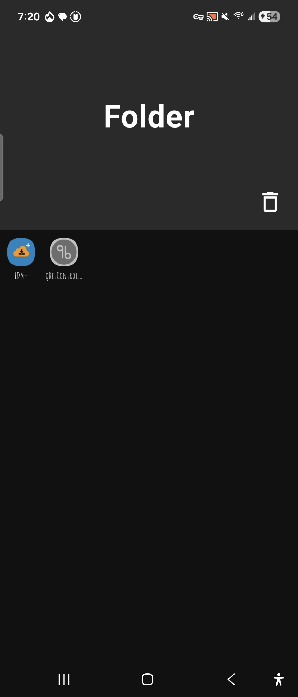

<h1> Launcher314</h1>

⚠️ PSA; shit will go wrong while using this app, there will be features missing that you wish I added; but this app is in **BETA** and in the very early stages of testing and development, so I'll try to make note of your issues, run through them myself and fix them as quick as possible. My goal is to get this app to a clean smooth state, but in order to do that, people like you can help test and present issues & features that come up. I will do my best to fix everything in a timely manner while incorperating **YOUR** feature wishlist in a way that I think will work for everyone :)

⚠️ Another PSA; these stores below are in the pipeline. As my apps get approved on each of them I'll move them up to the section right underneath the title section of the readme. As of now these links take you nowhere. With that being said, you may wait for the app to be uploaded to a trusted store, and I'll continue developing and making changes for those of you who download it the "raw" way. Thanks again.

  

## About

I built this launcher for people to be able to easily access settings and customization all from one screen without having to go on a scavenger hunt to change something simple like row count or font size. I built this app to help me move to a more secure OS and thought oh, other people can use this too!

All your data is stored locally on the device, no exuberant permissions required such as internet connection or any data collection libraries (you can check with apps like TrackerControl or apps that will scan libraries for trackers).

One screen customization with preview windows to view your changes prior to even going into the launcher. Just like most launchers, icons, folders, and everything in the preview areas use bitmaps; while widgets are the only item using Live AndroidView. In the preview section you will see we have multiple ways to customize the launcher with columns & rows being independent of each-other in the Home Screen / App Drawer sections but only being bound by a universal icon size indicator making sure apps and text don't go out of bounds on each-other. In the app drawer you will also see a square check mark box next to the app drawer rows; this selection will switch you between the scroll mode & paged mode drawers and if you scroll further down to the scroll bar/ navigation drop down, you can customize both navigation indicators to you liking. Just above that you will notice an icon text dropdown where you can choose rom various fonts (most popular ones from other Launcher3 forks) & a way to adjust the text size.

Using this app is pretty straight forward and everything is contained in a few screens or less so you spend less time trying to figure out what a selection does or where to find a specific setting and instead just jump right in to customization and setting up the launcher; a feature I felt that most other launchers didn't do well.

Anyways who reads these descriptions anyways. Get in there buddy.

## Screenshots

## License

Launcher314 is licensed under the GNU General Public License v3.0. See the [LICENSE](LICENSE) file for details.

This app is free and open source software (FOSS).
